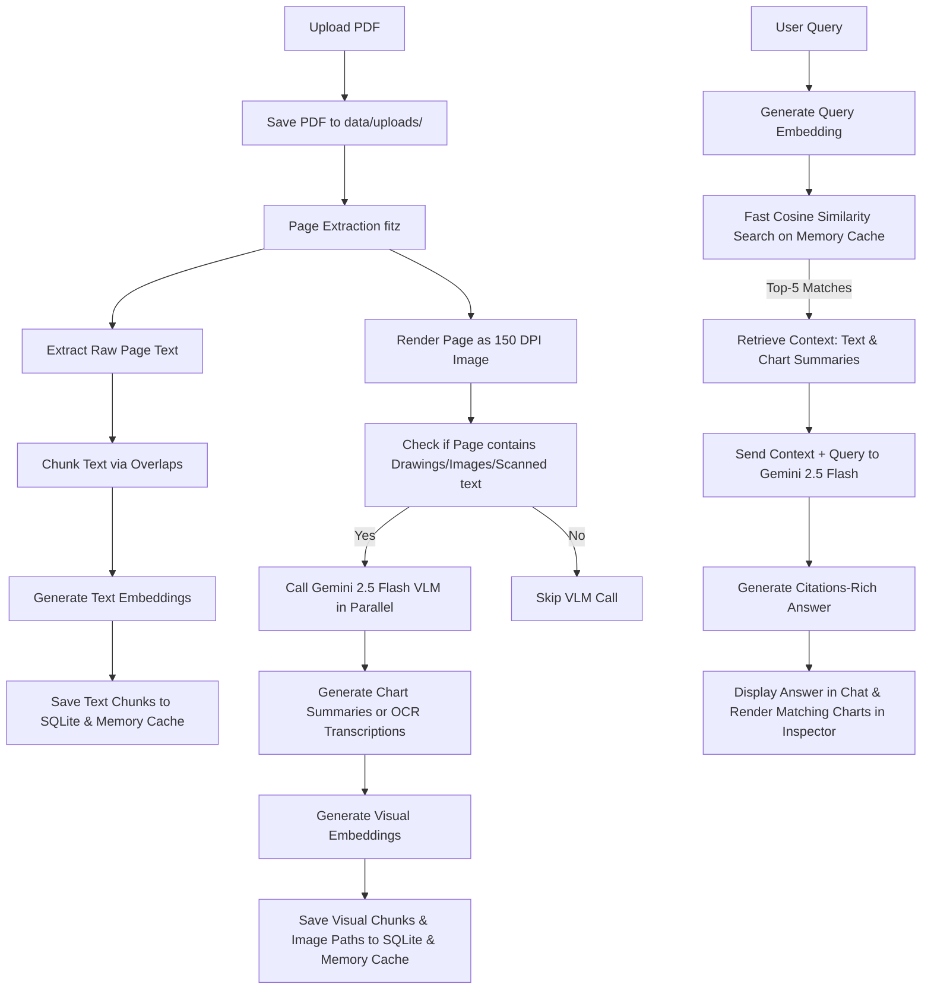

# Multimodal RAG: Intelligent Chart & Document Analyzer

This application is an end-to-end **Multimodal Retrieval-Augmented Generation (RAG)** system designed to ingest complex, unstructured documents (such as financial reports, research papers, and invoices) containing both plain text and rich visual elements (such as line charts, bar graphs, tables, and diagrams). 

It segmentally parses document text, uses a **Vision-Language Model (VLM)** to extract and summarize visual layouts/charts, embeds both text and chart descriptions into a local vector database, and lets users interactively query the documents. When answering queries, it references and visually displays the actual source pages and charts in a high-fidelity inspector UI.

---

## 🚀 Key Features

*   **Segmental Text & Visual Parsing:** Page-by-page text extraction and overlap chunking of PDF pages using `PyMuPDF`.
*   **Parallel Multimodal Visual Summarization:** Automatically renders PDF pages as images and passes them in parallel (using `ThreadPoolExecutor`) to the Gemini VLM (`gemini-2.5-flash`) to detect, analyze, and translate graphs, charts, flowcharts, and tables into descriptive markdown summaries.
*   **Smart VLM Skip (Cost & Token Efficiency):** Uses low-overhead vector path and image checks (`page.get_drawings()` and `page.get_images()`) to bypass VLM API calls on pages containing only standard paragraphs of text.
*   **Scanned Image & OCR Support:** Automatically detects scanned or image-only pages (when digital text extraction yields < 50 characters) and triggers a dedicated VLM OCR prompt to transcribe the text.
*   **Fast Persistent Vector DB:** A customized, lightweight SQLite-backed vector store that houses text embeddings (`models/gemini-embedding-001`), metadata, and visual summaries.
*   **In-Memory Embedding Cache:** Speeds up search queries to sub-millisecond latency by caching deserialized float vectors in-memory, avoiding SQLite JSON parsing bottlenecks during queries.
*   **Three-Panel Workspace UI:**
    *   **Interactive Chat (Left Panel):** Ask questions, see response citations, and select dynamic suggested queries.
    *   **Source Inspector (Right Panel):** Click source citations to view the exact retrieved text segments, chart descriptions, and zoom into the actual rendered PDF page or diagram matching the response.
    *   **Page Browser (Right Panel - Tab 3):** View and browse all pages of the selected document directly, rendering page images on-demand.
*   **Figma-Style Visual Map Viewport:** Supports mouse scroll-wheel zooming and click-and-drag panning on rendered pages in the visual inspector for close detail inspection.
*   **Dynamic Document-Specific Suggestions:** Calls Gemini to automatically analyze the content of a newly uploaded document and generate 3 custom questions tailored to its text and charts.
*   **Persistent API Setup:** Saves your Gemini API Key securely to a local configuration file (`data/config.json`) so it automatically persists across server restarts and code reloads.
*   **Theme Toggle (Light/Dark Mode):** Dynamic styling theme switch that toggles between dark mode (default) and light mode. The theme setting is persisted locally in the browser's `localStorage`.

---

## 🛠️ Technology Stack

*   **Language:** Python 3.10+
*   **Framework:** FastAPI (Backend), Vanilla HTML5/CSS3/JS (Frontend)
*   **VLM Engine:** Google Generative AI (Gemini 2.5 Flash & Gemini Embedding 001)
*   **Parser:** PyMuPDF (`fitz`) & Pillow (`PIL`)
*   **Vector Store:** SQLite (Data Storage) + Python Math (Cosine Similarity) + In-memory Cache
*   **Web Server:** Uvicorn

---

## 📦 Project Structure

```
project/
│
├── backend/
│   ├── __init__.py
│   ├── app.py                # FastAPI endpoints (upload, search, config, chat, suggestions)
│   ├── config.py             # Folder and environment configurations (persists API key)
│   ├── document_processor.py # PDF extraction, parallel VLM visual analyzer, OCR, and RAG generator
│   └── vector_store.py       # Custom SQLite vector database, cosine similarity math, & in-memory cache
│
├── frontend/
│   ├── index.html            # Web interface layout (Page Browser & Suggestions UI)
│   ├── style.css             # Glassmorphic dark styling, page cards, & zoom/pan transforms
│   └── app.js                # Frontend client code, drag-drop upload, chat, panning/zooming canvas
│
├── data/                     # Local data storage (Auto-generated on startup)
│   ├── uploads/              # Saved PDF documents
│   ├── extracted_images/     # Extracted page rendering snapshots
│   ├── config.json           # Persistent configuration storage
│   └── vector_store.db       # Persistent SQLite vector database
│
├── requirements.txt          # Python library dependencies
└── README.md                 # Project documentation (This file)
```

---

## ⚙️ Ingestion & RAG Pipeline Architecture



---

## 📥 Getting Started

### 1. Prerequisites
Ensure you have **Python 3.10+** installed on your system.

### 2. Set Up a Virtual Environment
In your terminal, navigate to the project directory and create a virtual environment:

```bash
# Create venv
python -m venv .venv

# Activate venv (Windows PowerShell)
.venv\Scripts\Activate.ps1

# Activate venv (Windows Command Prompt)
.venv\Scripts\activate.bat

# Activate venv (Mac/Linux)
source .venv/bin/activate
```

### 3. Install Dependencies
Install the required python packages from `requirements.txt`:

```bash
pip install -r requirements.txt
```

### 4. Run the Application Server
Launch the FastAPI server using Uvicorn:

```bash
python -m uvicorn backend.app:app --reload
```

The server will spin up on **`http://127.0.0.1:8000`**.

---

## 💻 How to Use

1.  **Open the Application:** Open your web browser and navigate to `http://127.0.0.1:8000`.
2.  **Setup Gemini API Key:** 
    *   Click **API Setup** in the top-right corner.
    *   Input your Google Gemini API key (you can grab a free-tier key from [Google AI Studio](https://aistudio.google.com/)).
    *   Click **Save Key**. The dot indicator will turn green (Active). The key is now persistently saved in `data/config.json`.
3.  **Upload a PDF:**
    *   Drag & drop a PDF document (e.g. [complex_operations_report.pdf](file:///C:/Users/Karun%20Kumar/Downloads/resume-chitti/project/complex_operations_report.pdf)) into the dashed upload area in the sidebar, or click to browse.
    *   The app will upload the PDF, render page image previews, run VLM visual processing and OCR parallelly, and batch-embed the records.
4.  **Interact & Chat:**
    *   Type any query in the input bar or click one of the **Dynamic Suggested Question** chips that appear automatically once the document is selected.
    *   The chat will generate an answer citing the exact source pages.
5.  **Inspect Visual Sources:**
    *   The retrieved context segments appear automatically in the **Source Inspector** on the right.
    *   For visual or chart matches, click the **Inspect Chart** or **Show Page** button. 
    *   This loads the page rendering in the **Visual Map** tab, allowing you to scroll-wheel zoom and mouse-drag pan to inspect charts, details, or stamps!
6.  **Page Browser:**
    *   Switch to the **Page Browser** tab inside the inspector. Click any page chip (e.g. Page 3) to view the rendered page directly.
